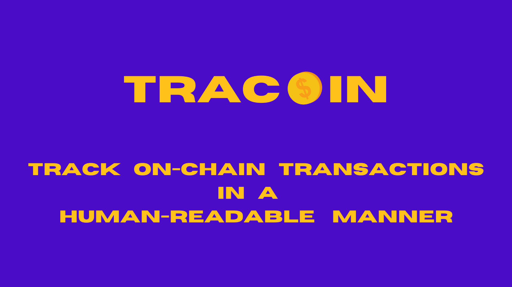
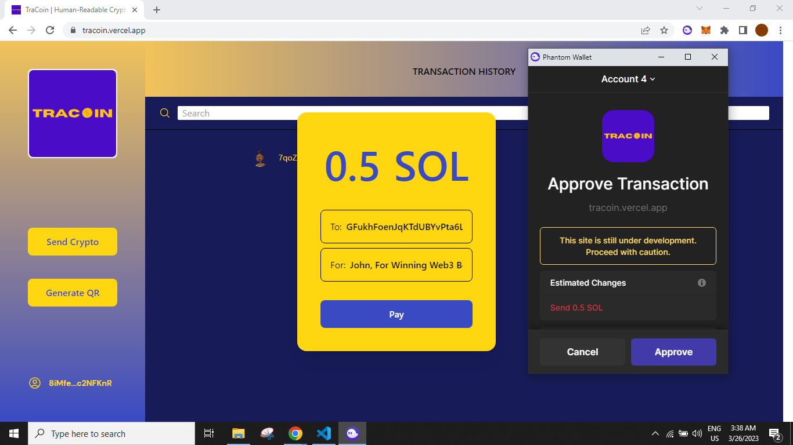
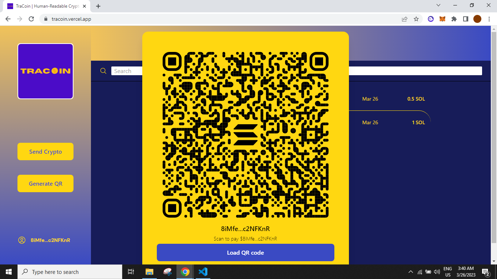
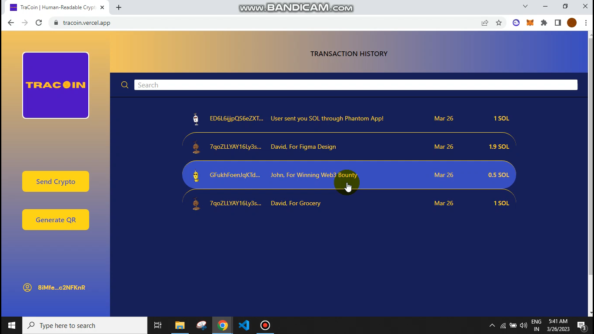

# TraCoin: 
**Track on-Chain transactions in a Human-Readable manner**

# Tech Stack Used: 
**Solana, Solana JS SDK, Solana Pay Library, NextJS, TailwindCSS, and Replit.**

# Video Link Explaining the Project and working: 
**https://www.youtube.com/watch?v=vAmgqI_7P-g**

# Tracks Covered: 
**Solana and Replit**



## Getting Started

First, run the development server:

```bash
npm run dev
# or
yarn dev
```

Open [http://localhost:3000](http://localhost:3000) with your browser to see the result.

You can start editing the page by modifying `pages/index.js`. The page auto-updates as you edit the file.

# Snippets of My Project:






